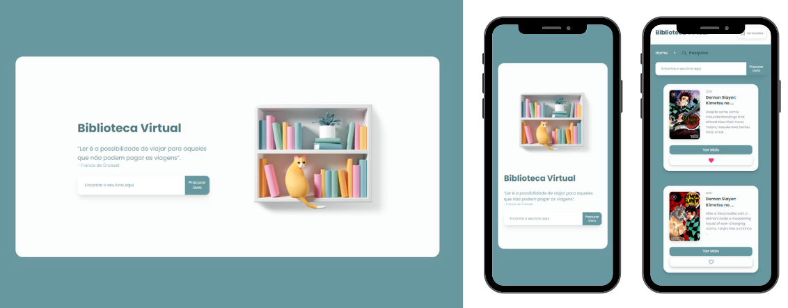

<br />
<p align="center">
  <h3 align="center">Biblioteca Virtual</h3>

  <p align="center">
    Sistema para encontrar informações sobre Livros
    <br />
    <a href="https://bibliotecavirtual.netlify.app/#/" target="_blank"><strong>Veja o site online »</strong></a>
    <br />
    <br />
  </p>


</p>

# 📌 Índice

- [Sobre o projeto](#sobre)
  - [Feito com](#feito)
- [Features](#features)
- [Iniciando o projeto](#iniciando)
  - [Pré-requisitos](#requisitos-minimos)
  - [Instalação](#instalacao)

## 💻 Sobre o projeto <a name="sobre"></a>

<p align="center">

 </p>

O projeto **Biblioteca Virtual** é um sistema para pesquisar livros utilizando a <a href="https://developers.google.com/books/" target="_blank">API do Google Books</a>. O projeto retorna informações como: Descrição, Data da Publicação, Autor, onde comprar, dentre outros. Também é possível favoritar títulos.

## 📝 Feito com <a name="feito"></a>

- TypeScript
- React
- Context API
- Styled Components
- React-router
- Responsividade

## 🖥 Features <a name="features"></a>

- Pesquisa de livros
- Tela de listagem de livros
- Tela de detalhes de livro
- Tela de favoritos
- Tela de não encontrado

## 🔴 Iniciando o projeto <a name="iniciando"></a>

### ❗ Pré-requisitos <a name="requisitos-minimos"></a>

Para rodar o projeto é necessário ter os seguintes itens instalados na sua máquina.

- Node 16
- TypeScript

### 📥 Instalação <a name="instalacao"></a>

Clone o repositório

```sh
git clone https://github.com/SwannyAlves/virtual-library.git
```

Instale as dependências rodando o comando

```sh
yarn install
```

Digite o comando para ligar o servidor

```JS
yarn start
```
